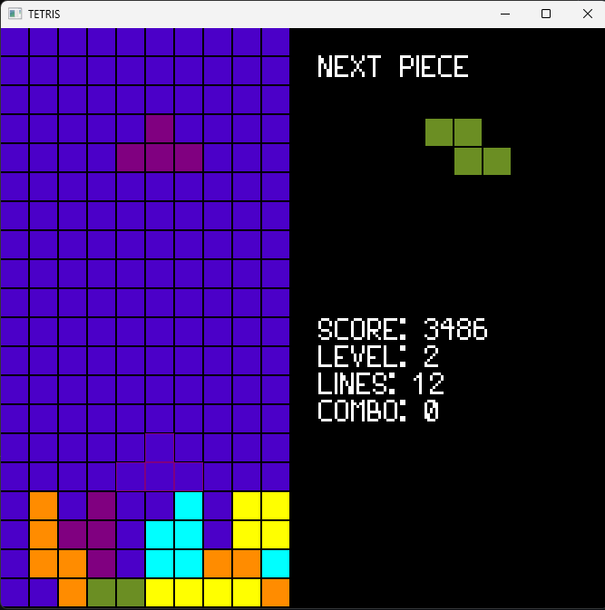

# Tetris Clone

A simple Tetris clone implemented in C++ using the SFML (Simple and Fast Multimedia Library). This project is a fun way to dive into game development, practicing your C++ skills, and learning how to work with graphics and user input in SFML.

## Table of Contents
- [Introduction](#introduction)
- [Features](#features)
- [Screenshots](#screenshots)
- [Installation](#installation)
- [How to Play](#how-to-play)
- [Controls](#controls)
- [Project Structure](#project-structure)
- [Contributing](#contributing)
- [License](#license)

## Introduction
This project is a Tetris clone built with **C++** and **SFML**. It includes classic Tetris features such as random tetromino generation, rotation, line clearing, and increasing difficulty as you progress. It is designed to be simple and lightweight, making it a great foundation for further development or as a learning project.

## Features
- Fully playable Tetris game
- Random tetromino generation
- Basic scoring and level progression
- Simple 2D graphics using SFML
- Smooth movement and rotation of tetrominos
- Line clearing with increasing speed as the game progresses
- Game over screen

## Screenshots

## Installation

### Prerequisites
Make sure you have the following installed:
- **C++17** or higher
- **SFML 2.5** or higher

### Play the game:
git clone https://github.com/your-username/tetris-clone.git 
cd tetris-clone/x64/Release 
Run Tetris.exe
   
## How to Play
The objective of the game is to move and rotate falling tetromino pieces to create horizontal lines without gaps. When a line is completed, it disappears, and the player earns points. The game ends when the pieces stack to the top of the screen.

## Controls
- **Left Arrow**/**A**: Move tetromino left
- **Right Arrow**/**D**: Move tetromino right
- **Up Arrow**/**W**: Rotate tetromino
- **Down Arrow**/**S**: Soft drop tetromino
- **Spacebar**: Hard drop tetromino
## License
### SFML

SFML - Copyright (C) 2007-2023 Laurent Gomila - laurent@sfml-dev.org

This software is provided 'as-is', without any express or implied warranty. In no event will the authors be held liable for any damages arising from the use of this software.

Permission is granted to anyone to use this software for any purpose, including commercial applications, and to alter it and redistribute it freely, subject to the following restrictions:

  1. The origin of this software must not be misrepresented; you must not claim that you wrote the original software.  If you use this software in a product, an acknowledgment in the product documentation would be appreciated but is not required.
  2. Altered source versions must be plainly marked as such, and must not be misrepresented as being the original software.
  3. This notice may not be removed or altered from any source distribution.

### External libraries used by SFML

  * _OpenAL-Soft_ is under the LGPL license
  * _stb_image_ and _stb_image_write_ are public domain
  * _freetype_ is under the FreeType license or the GPL license
  * _libogg_ is under the BSD license
  * _libvorbis_ is under the BSD license
  * _libflac_ is under the BSD license
  * _minimp3_ is under the CC0 license
